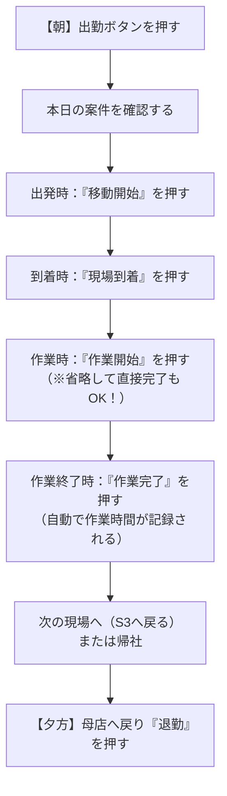

<!-- markdownlint-disable MD033 MD041 -->

  
  <h1 class="cover-title">WorkWise</h1>
  
現場スタッフ操作マニュアル (完全版)

  
TOYOTA MOBILITY PARTS　KANAGAWA BRANCH

# WorkWise 現場スタッフ操作マニュアル

WorkWise（ワークワイズ）へようこそ！  
本システムは、現場スタッフの皆様がスマートフォンから簡単なボタン操作を行うだけで、日々の作業進捗や移動状況を支社・管理者にリアルタイム共有できるシステムです。

このマニュアルは、**初めてWorkWiseを使う方でも、朝の出勤から夕方の退勤まで迷わず操作できるように、最初から順番に分かりやすく解説**しています。手元に置いてご活用ください。

---

## 目次
1. **事前準備（ログイン・ホーム画面への追加）**
2. **画面の見方（基本画面とタスク確認）**
3. **一日の基本業務フロー（朝の出勤から夕方の退勤まで）**
4. **同一店舗で2台以上作業する場合の操作**
5. **打刻を間違えた・忘れたときの修正方法（修正モード）**
6. **緊急時の連絡方法**
7. **よくある質問と困ったときの対処法（Q&A）**

---

## 1. 事前準備（ログイン・ホーム画面への追加）

### ① アプリへのアクセスとログイン
1. スマートフォンのブラウザ（iPhoneならSafari、AndroidならChrome）を開きます。
2. 配布された WorkWise のURLにアクセスします。
3. ログイン画面で、管理者から配布された **「メールアドレス」** と **「パスワード」** を入力します。
4. **「ログイン」** ボタンを押します。

> [!TIP]
> **スマートフォンのホーム画面に追加すると便利です！**  
> ブラウザの共有ボタンから「ホーム画面に追加」を行うと、スマホの画面にアプリアイコンが作成され、次回から通常のアプリと同じようにワンタップで起動できます。

### ② 位置情報（GPS）の利用許可
- 初回アクセス時に「位置情報の利用を許可しますか？」という確認ダイアログが表示されます。必ず **「許可」** または **「Appの使用中は許可」** を選択してください。
- 各ボタンを押した際の位置情報が自動記録され、正確な配車管理や安全管理に活用されます。

---

## 2. 画面の見方（基本画面とタスク確認）

ログインすると、本日の業務画面が表示されます。

### ① 画面上部：出勤・退勤ステータス
- 画面の一番上には、あなたの名前と、現在の勤務ステータス（「未出勤」「出勤済」「退勤済」など）が表示されます。

### ② 本日の担当案件リスト
- あなたに割り当てられている本日の作業予定が一覧で表示されます。
- **カードに記載されている内容**:
  - **訪問先店舗名**: お客様先（販売店名）
  - **予定時間**: 当初予定されている作業時間
  - **作業内容**: タイヤサイズ、本数、作業種別など
  - **特記事項**: 現場での注意事項や顧客からの要望など

### ③ 「自分のタスクのみ表示」機能（★便利機能）
画面上のスイッチをONにすると、**他のスタッフの予定が隠れ、自分が担当する案件だけがスッキリ絞り込み表示**されます。案件を探す手間が省けて大変便利です。

### ④ チェックイン画面への移動
作業を行う案件のカードをタップすると、その案件の **「チェックイン（操作画面）」** に移動します。

---

## 3. 一日の基本業務フロー（最初から最後まで）

日々の業務は、以下の **STEP 1 〜 STEP 6** の順序で進めます。

---

### 【朝】STEP 1：出勤する
- 業務を開始する際、画面上部の **「出勤」** ボタンを一度だけ押します。
- ボタンが「出勤済」に変わり、管理者ダッシュボードに出勤が反映されます。

---

### STEP 2：予定を確認し、現場へ出発する
1. 本日の予定リストから、最初に向かう案件をタップしてチェックイン画面を開きます。
2. 必要に応じて **「タスク確認」** を押します（案件内容を確認済みとして記録されます）。
3. 現場へ向けて出発するタイミングで **「移動開始」** ボタンを押します。
   - 管理者側の画面であなたのステータスが「移動中」になり、現場への移動開始時刻が記録されます。

---

### STEP 3：現場に到着する
- 販売店（お客様先）に到着したら、車を停めて **「現場到着」** ボタンを押します。
- ステータスが「作業待ち」に変わり、現場への到着時刻が記録されます。

---

### STEP 4：作業を開始する（★省略可能）
- 工具やタイヤの準備を終え、実際の作業に取り掛かるタイミングで **「作業開始」** ボタンを押します。
- ステータスが「作業中」に変わります。

> [!IMPORTANT]
> ### 作業開始ボタンは押し忘れても大丈夫！（現場改善機能）
> - 「作業開始を押し忘れて作業を始めてしまった！」という場合でも、**作業終了後にそのまま「作業完了」ボタンを押せばOK**です。
> - システムが「現場到着」から「作業完了」までの時間を自動的に計算し、正しい作業所要時間として記録します。
> - **直前連打の自動救済**: 作業終了直前に慌てて「作業開始 ➡️ すぐに作業完了」と連打した場合でも、開始〜完了が3分以内であれば、自動的に到着時刻から正しい所要時間を逆算します（作業時間1分問題を自動防止）。

---

### STEP 5：作業を完了する
- すべての作業・片付け・点検が完了したら、**「作業完了」** ボタンを押します。
- ステータスが「作業完了」となり、実作業時間が自動計算されてデータベースおよび日報スプレッドシートに記録されます。

---

### 【夕方】STEP 6：帰社・退勤する
1. **帰社する**:
   - 現場から支社や母店へ戻る出発の際、**「帰社」** ボタンを押します。
   - GPS位置情報から母店への推定到着時刻（ETA）が自動計算され、管理者に共有されます。
2. **退勤する**:
   - 母店に戻り、一日のすべての業務が終了したら **「退勤」** ボタンを押します。
   - ステータスが「退勤済」となり、一日の業務記録が完了します。お疲れ様でした！

---

## 4. 同一店舗で2台以上連続で作業する場合

同じ店舗で2台や3台の作業が連続している場合、移動がないため**不要なボタン操作（移動開始・現場到着）を完全スキップ**できます！

### ① 画面上の進行バッジ
画面上部に `🚗 同店舗での作業: 1台目 / 全2台 [現場到着済]` と表示され、同じ場所での作業であることが自動認識されます。

### ② 1台目の作業完了時のポップアップ
1台目の作業を終えて「作業完了」を押すと、次の進め方を選ぶポップアップ画面が表示されます。

現場の状況に合わせて、以下のいずれかを選んでください：

#### 【方法A】1台ずつ順番に進める場合
- **「🚗 続けて2台目の作業へ進む」** を押します。
- 次の車両の画面へ自動的に切り替わります。
- 現場到着はすでに完了しているため、**移動開始・現場到着は自動スキップ**され、最初から「作業開始」または「作業完了」を押せます。

#### 【方法B】全台終わってからまとめて完了にする場合（✨おすすめ）
- スマホは触らずに、2台（または3台）連続でタイヤ交換作業を行います。
- すべての作業が終わった後、1台目の画面で「作業完了」を押し、ポップアップで **「✨ この店舗の残り全件（○台）もまとめて作業完了にする」** を押します。
- **【自動按分】**: 最初の到着（または開始）から最後の完了までの**総作業時間が、台数（全件）で自動均等割り**されて全受注に自動記録されます！
  - *例: 10:00到着 ➡️ 11:00全台完了（計60分・2台）の場合、1台目・2台目ともに「作業時間30分」として自動入力されます。*

---

## 5. 打刻を間違えた・忘れたときの修正方法（修正モード）

「ボタンを押し忘れて後から記録したい」「打刻した時間を直したい」という場合も、簡単に修正できます。

### 操作手順
1. 画面右上の **「修正モード」スイッチをON** にします（画面が赤枠になり、打刻修正モードになります）。
2. 対象の案件を選択します。
3. **作業完了後の案件であっても、すべてのボタン（移動開始・現場到着・作業開始・作業完了・帰社・位置情報更新）が濃い赤枠で押せる状態になります。**
4. 修正したいボタンをタップします。
5. **修正時間入力ダイアログ** が表示されます：
   - すでに記録されている打刻時刻（例: `09:30`）が**初期値として自動セット**されています。
   - 正しい時刻に変更して **「決定」** を押します。
6. 修正が完了すると、自動的にデータベースへ反映され、作業所要時間も最新の時刻から自動再計算されます。
7. 修正が終わったら、右上の「修正モード」スイッチをOFFに戻します。

> [!NOTE]
> **安全保護仕様**: 完了済みのタスクに対して過去の時刻（現場到着や作業開始）を修正しても、ステータスが勝手に「作業中」に戻ってしまうことはありません。「作業完了」ステータスを維持したまま、打刻時刻と作業時間のみが安全に更新されます。

---

## 6. 緊急時の連絡方法

事故、車両トラブル、道路の激しい渋滞などが発生した場合は、緊急連絡機能を使って管理者に即座に通知できます。

1. 画面下部の **「緊急連絡」** 入力欄に状況（例: 「首都高事故渋滞のため、到着が約30分遅れます」など）を入力します。
2. 赤色の **「緊急連絡を送信」** ボタンを押します。
   - 管理者のダッシュボード画面に赤色の緊急アラートバナーが点滅表示されます。
3. **管理者からの返信の確認**:
   - 管理者がメッセージを確認して返信すると、画面上に返信内容が表示されます。
4. **緊急連絡の解除**:
   - 状況が解決した場合、送信ボタン横の **「解除」** ボタンを押すとアラートを取り消せます。

---

## 7. よくある質問と困ったときの対処法（Q&A）

### Q. ボタンを押しても画面が切り替わらない・固まってしまった
- **対処法**: ブラウザの再読み込み（リロード）ボタンを押してください。データは安全にサーバーに保存されているため、リロードしても消えません。

### Q. ボタンがグレー（半透明）で押せない
- **対処法**: WorkWiseでは誤操作を防ぐため、業務の流れ通りの順序でのみボタンが押せるようになっています（例: 移動開始を押す前は現場到着は押せません）。
- もし押し忘れ等で過去のボタンを押したい場合は、画面右上の「修正モード」をONにするとすべてのボタンが押せるようになります。

### Q. 地下やトンネルなど、電波の悪い場所で作業するときは？
- **対処法**: 電波が届かない場所では、無理にボタンを押さず、作業終了後に電波の良い場所へ移動してから「修正モード」を使って実際の作業時刻を入力してください。

### Q. ログイン画面に戻ってしまった
- **対処法**: 通信の切断やセッション切れの可能性があります。再度メールアドレスとパスワードを入力してログインしてください。ログインできない場合は管理者へご連絡ください。

---

本日も一日、周囲の安全に十分注意して作業をお願いいたします。ご安全に！
