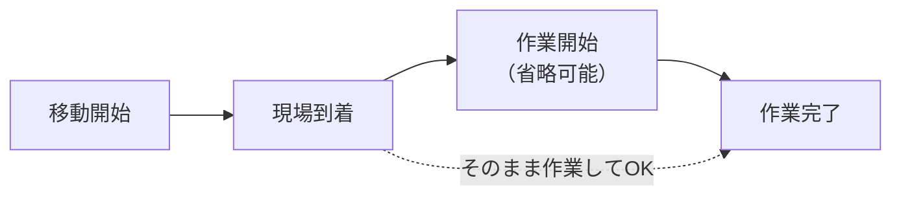

<!-- markdownlint-disable MD033 MD041 -->

  
  <h1 class="cover-title">WorkWise</h1>
  
現場スタッフ操作マニュアル (データベース版)

  
TOYOTA MOBILITY PARTS　KANAGAWA BRANCH

# WorkWise 現場スタッフ操作マニュアル (データベース版)

WorkWiseへようこそ！  
本システムはデータベース（Firestore）とリアルタイムに連携しており、スマートフォンの画面からボタンを押すだけで、現場の進捗状況が管理者に即座に共有されます。  
このマニュアルでは、日々の現場業務をスムーズに行うための操作手順について、分かりやすく説明します。

---

## 1. 業務開始（ログイン・出勤・本日の予定確認）

### ① ログイン
1. 配布されたURLにスマートフォン等のブラウザからアクセスします。
2. 登録されたメールアドレスとパスワードを入力し、「ログイン」ボタンを押します。

### ② 出勤打刻
- 画面上部に表示される **「出勤」** ボタンを一度押します。
- ボタンが「出勤済」に変わり、管理者画面に出勤状況が即座に反映されます。

### ③ 今日の予定を確認する（★新機能：「自分のタスクのみ表示」）
- 画面に表示される本日の担当案件（オーダーリスト）を確認します。
- **「自分のタスクのみ表示」スイッチ**:
  - スイッチをONにすると、**自分が担当する案件だけが絞り込まれて一覧表示**されます。他のスタッフの案件に埋もれることなく、当日のスケジュールを迷わず確認できます。

---

## 2. 現場へ向かう・作業する（基本フロー）

担当の案件に対して、業務の進捗に合わせて順番にボタンを押して報告します。

### 各ボタンの役割
1. **「移動開始」**: 現場へ向けて出発するタイミングで押します。
2. **「現場到着」**: 販売店（お客様先）に到着したタイミングで押します。
3. **「作業開始」**: 実際の作業に取り掛かるタイミングで押します。（**★省略可能**）
4. **「作業完了」**: 作業・片付けがすべて終了したタイミングで押します。

> [!TIP]
> ### 現場到着から直接「作業完了」を押してもOKです！
> - 「作業開始」ボタンを押し忘れて作業を始めてしまった場合でも、**作業終了後にそのまま「作業完了」ボタンを押せばOK**です！
> - 現場到着から作業完了までの時間が、自動的に「作業所要時間」として計算され記録されます。
> - **直前連打救済**: 作業終了直前に慌てて「作業開始 ➡️ すぐに作業完了」と連打した場合でも、自動的に現場到着時刻から正確な所要時間が逆算されます（作業時間1分問題を自動防止）。

---

## 3. 同一店舗で2台以上連続で作業する場合（★超効率化機能）

同じ店舗で2台や3台の連続作業がある場合、移動がないため**不要な打刻（移動開始・現場到着）を完全スキップ**できます！

### 画面上部の進行バッジ
画面上部に `🚗 同店舗での作業: 1台目 / 全2台 [現場到着済（移動不要）]` のように、何台目の作業を行っているかが分かりやすく表示されます。

### 1台目の作業完了時の操作
1台目の作業が終わって「作業完了」を押すと、以下の選択ポップアップが表示されます。

状況に合わせて、どちらか都合の良い方法を選んでください：

#### パターンA：1台ずつ順番に進める場合
- **「🚗 続けて2台目の作業へ進む」** を押します。
- 自動的に2台目の作業画面に切り替わります。
- 現場到着はすでに済んでいるため、**移動開始・現場到着は自動スキップ**され、最初から「作業開始」または「作業完了」を押せます。

#### パターンB：全台終わってからまとめて完了にする場合（✨おすすめ）
- スマホを触らずに2台まとめて作業を実施します。
- すべての作業が終わった後、1台目の画面で「作業完了」を押し、ポップアップで **「✨ この店舗の残り全件（○台）もまとめて作業完了にする」** を押します。
- **【自動按分】**: 最初の到着（または開始）から完了までの**総作業時間を、台数（全件）で自動均等割り**して全受注に自動記録されます！
  - *例: 10:00到着 ➡️ 11:00全台完了（計60分・2台）の場合、1台目・2台目ともに「作業時間30分」として自動入力されます。*

---

## 4. 打刻時刻の修正・入力（★修正モードの大幅改善）

「ボタンを押し忘れて後から記録したい」「打刻した時間を修正したい」という場合は、画面右上の **「修正モード」** を使用します。

### 操作手順
1. 画面右上の **「修正」スイッチをON** にします（画面が赤枠になり、打刻修正モードになります）。
2. 対象の受注（案件）を選択します。
3. **作業完了後のタスクであっても、すべてのボタン（移動開始・現場到着・作業開始・作業完了・帰社・位置情報更新）が濃い赤枠で押せる状態になります。**
4. 修正したいボタンをタップします。
5. **修正時間入力ダイアログ** が開きます：
   - すでに記録されている時刻（例: `09:30`）が**初期値として自動セット**されています。
   - 正しい時刻に変更して **「決定」** を押します。
6. 修正が完了すると、自動的にFirestoreおよびスプレッドシートへ反映され、所要時間も最新時刻から自動再計算されます。

> [!NOTE]
> - **安全仕様**: 完了済みのタスクの過去打刻（現場到着や作業開始）を修正しても、ステータスが「作業中」に巻き戻ることはありません。「作業完了」ステータスを維持したまま、打刻時刻と所要時間のみが安全に更新されます。
> - また、稼働中のスタッフ自身のリアルタイムステータスが過去状態に上書きされることもありません。

---

## 5. 緊急時の連絡

事故、車両トラブル、道路渋滞による大幅な遅れなどが発生した場合は、緊急連絡機能を使って管理者に即座に通知できます。

1. 画面下部の **「緊急連絡」** 入力欄に状況（例: 「事故渋滞のため到着が30分遅れます」など）を入力します。
2. 赤色の **「緊急連絡を送信」** ボタンを押します。
   - 管理者のダッシュボード画面に赤色の緊急アラートバナーが点滅表示されます。
3. **緊急連絡の解除**:
   - 状況が解決した場合、送信ボタン横の **「解除」** ボタンを押すとアラートを取り消せます。
4. **管理者からの返信**:
   - 管理者から返信メッセージが届いた場合、画面上に「管理者からの返信」として表示されます。

---

## 6. 業務終了（帰社・退勤）

1. **「帰社」ボタン**:
   - 現場から支社・母店へ戻る出発時に「帰社」を押します。GPS位置情報から母店への推定到着時刻（ETA）が自動計算され、管理者に共有されます。
2. **「退勤」ボタン**:
   - 支社に戻り、一日のすべての業務が終了したら「退勤」ボタンを押します。ステータスが「退勤済」となり、一日の業務が完了します。

---

## 困ったときは？

- **画面の表示が更新されない**: ブラウザの再読み込み（リロード）を行ってください。
- **電波が悪い場所での操作**: 電波が復旧した際に再度ボタンを押すか、後から「修正モード」で実績時間を入力してください。
- **ログインできない**: 管理者へ連絡し、パスワードの確認または再設定を依頼してください。

本日も一日、ご安全に！
